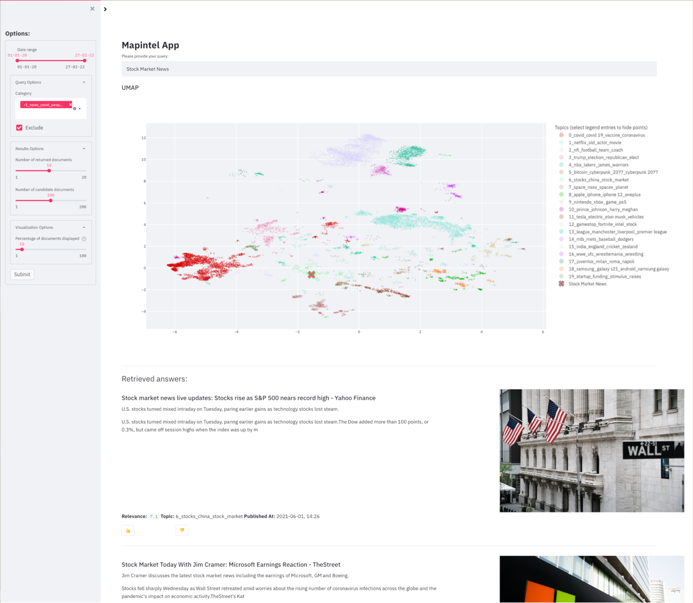
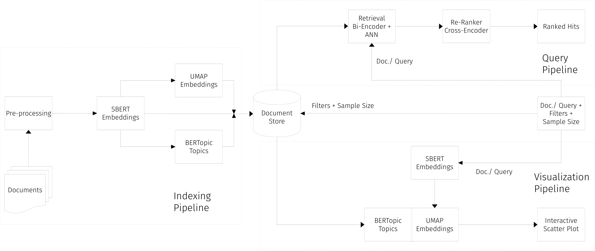

# MapIntel Project :mag_right:

MapIntel is a system for acquiring intelligence from vast collections of text data by representing each document as a multidimensional vector that captures its own semantics. The system is designed to handle complex Natural Language queries and visual exploration of the corpus.

The system searching module uses a retriever and re-ranker engine that first finds the closest neighbors to the query embedding and then sifts the results through a cross-encoder model that identifies the most relevant documents. The browsing module also leverages the embeddings by projecting them onto two dimensions while preserving the multidimensional landscape, resulting in a map where semantically related documents form topical clusters which we capture using topic modeling. This map aims at promoting a fast overview of the corpus while allowing a more detailed exploration and interactive information encountering process.

MapIntel can be used to explore many different types of corpora. As an example, we use it to explore a corpus of news articles (330K entries) we collected from [NewsAPI](https://newsapi.org/) from October 2020 to June 2021.



## MapIntel Research

Research associated with the MapIntel system can be found at [mapintel_research](https://github.com/NOVA-IMS-Innovation-and-Analytics-Lab/mapintel_research). It contains publications, scripts for experiments, and Jupyter Notebooks to explore some of the technical concepts underlying the system.

## MapIntel Data

This project consists of a web application with user interface and backend, which relies on some input data. The [mapintel_data](https://github.com/NOVA-IMS-Innovation-and-Analytics-Lab/mapintel_data) project contains the pipeline for collection and preprocessing of different corpora.

New corpora can be easily added to the system by following the instructions below. New corpora should be structured as a json file with the following key-value pairs:
- *text*: text that the model will use to represent the document;
- *title*: title used by the user interface to represent the document;
- *url*: url used to access the full original document from its source;
- *timestamp*: datetime string that marks the release of the original document. Formatted as "%d-%m-%Y %H:%M:%S";
- *snippet*: **optional** excerpt of the document displayed in the user interface. If not given, text will be used for this function;
- *image_url*: **optional** headline image url of the document used in the user interface. If not given, a placeholder image is used instead;

Example corpus json file:
``` 
[
  {
    'text': 'Eagles to start Jalen Mills at cornerback, Marcus Epps at safety against 49ers | Report - Bleeding Green Nation Secondary change up. The Philadelphia Eagles will be starting Jalen Mills at cornerback and Marcus Epps at safety in their Week 4 game against the San Francisco 49ers, according to one report:#Eagles lineup changes, pe',
    'image_url': 'https://cdn.vox-cdn.com/thumbor/zAtOYRtDGrSfDrlfk1gh2VHHAjQ=/0x167:1883x1153/fit-in/1200x630/cdn.vox-cdn.com/uploads/chorus_asset/file/20098871/usa_today_13755700.jpg',
    'url': 'https://www.bleedinggreennation.com/2020/10/4/21501492/jalen-mills-eagles-vs-49ers-cornerback-safety-marcus-epps-kvon-wallace-philadelphia-nfl-news-game',
    'title': 'Eagles to start Jalen Mills at cornerback, Marcus Epps at safety against 49ers | Report - Bleeding Green Nation',
    'snippet': 'Secondary change up. The Philadelphia Eagles will be starting Jalen Mills at cornerback and Marcus Epps at safety in their Week 4 game against the San Francisco 49ers, according to one report:#Eagles lineup changes, pe',
    'timestamp': '04-10-2020 21:52:27'
  },
  {
      ...
  },
]
```

### Add new corpora
To add a new corpus to the system, first you need to format it as explained above. Then put the json file inside the artifacts folder and edit the docker-compose.yml file by changing the line starting with `command:` and put the name of the dataset, like so: `command: ["<dataset name>"]`.

**TODO:** In the future an API should be defined to easily add new corpora, even from remote locations (e.g. a yml file with a fixed structure that defines every dataset attribute and that can be easily adapted to any data. This can be further enhanced by merging the api/pipeline.yml and the new data yml file into a single configuration file for the system).

## Docker images

It is possible to run a local version of MapIntel, required that [Docker](https://docs.docker.com/engine/install/) and [Docker Compose](https://docs.docker.com/compose/install/) are installed. This can be achieved by using the docker images provided in the [container registry](https://github.com/orgs/NOVA-IMS-Innovation-and-Analytics-Lab/packages?repo_name=mapintel_project). There are separate images for server backend, both with a CPU (mapintel-api-cpu) and GPU (mapintel-api-gpu) host, and frontend (mapintel-ui). In addition, it uses the official [Open Distro for Elasticsearch (ODFE)](https://hub.docker.com/r/amazon/opendistro-for-elasticsearch) image.

### Run MapIntel from docker images

- For production workloads (if you just want to test it locally you might not need to do this), ODFE server image requires the following command to be run (as root) to work properly:
`sysctl -w vm.max_map_count=262144`

More information [here](https://opendistro.github.io/for-elasticsearch-docs/docs/install/docker/#important-settings) and [here](https://www.elastic.co/guide/en/elasticsearch/reference/current/vm-max-map-count.html).

- Create and start the containers by running the following command from the project directory:
  - if the host has a CUDA-enabled GPU:
    `docker-compose --profile gpu up`
  - else:
    `docker-compose --profile cpu up`

This will pull the latest docker images from the registry and run the containers. When the containers are up, it will check whether there are any records in the database and if there is none, it will download the data dump, embed the documents and index them. This process can take a considerable amount of time, specially if the host doesn't have a CUDA-enabled GPU.

After seeing this message:
```
mapintel-project-api-gpu-1   | ####################################################################
mapintel-project-api-gpu-1   | 
mapintel-project-api-gpu-1   | MapIntel application is ready!
mapintel-project-api-gpu-1   | 
mapintel-project-api-gpu-1   | Server is available at http://localhost:8501
mapintel-project-api-gpu-1   | 
mapintel-project-api-gpu-1   | ####################################################################
```

the application will be available at localhost:8501, while the REST API will be available at localhost:8000/docs#.

## Important settings :warning:

Before running MapIntel using the docker images, make sure that the **.env file** exists. This file contains Environmental Variables. As an example, we provide the .env.example file that contains all the key-value pairs that should exists in the .env file. Below, we give a description of these variables:

- NEWSAPIKEY: The NewsAPI key. It can be obtained by [creating an account](https://newsapi.org/register) with NewsAPI.
- DEBUG: Whether to run the application in DEBUG mode. Takes 0 or 1 value. By passing DEBUG=1 the system will load only a small portion of the corpus, making the process of creating the database faster.

## MapIntel Architecture



The MapIntel system is composed of three main pipelines: Indexing, Query, and Visualization whose objectives are to get documents and their metadata from a source to a database, retrieve the most relevant results to a user query, and produce an interactive interface for exploring the document collection, respectively.

For a detailed explanation of the system architecture we suggest the reading of the [MapIntel paper](https://github.com/NOVA-IMS-Innovation-and-Analytics-Lab/mapintel_research/blob/main/docs/main.pdf), section 3.

## REST API reference

The API at localhost:8000/docs# consists of 4 distinct modules: Search, Topic, Upload, and Feedback. Below is a list of the API endpoints grouped according to the 4 modules.

### Search
- query: 
> Performs a query on the document store based on semantic search and approximate nearest neighbors. Also, applies boolean filters to the documents before performing semantic search.
- all-docs-generator: 
> Returns a Streaming Response consisting of a generator that iterates over the document store, given a set of boolean filters. The documents aren't iterated in any particular order.
- doc-count: 
> Gets the number of documents in the document store that satisfy a particular boolean filter.

### Topic
- umap-query: 
> Loads the TopicRetriever with its trained Topic model. Uses the underlying trained UMAP model to call transform() on the embedding of the query string and returns the resulting 2-dimensional UMAP embedding.
- topic-names: 
> Gets the unique topic names in the document store.
- topic-training: 
> Trains the Retriever's topic model with the documents in the database and updates the instances in the database using the new model. This endpoint can be used to update the topic model on a regular basis. Saves the trained model to disk.

### Upload
- news-upload: 
> Gets the latest news from NewsAPI and respective metadata, cleans the documents, and runs them through the indexing pipeline to be stored in the database.

### Feedback
- feedback: 
> Writes the feedback labels of responses to a query into the document store.
- eval-feedback: 
> Return basic accuracy metrics based on the user feedback. Which ratio of documents was relevant? You can supply filters in the request to only use a certain subset of labels.

## Project Organization

    ├── api                         <- API based on FastAPI that connects the database with the rest of the application
    │   │
    │   ├── controller              <- Defines the FastAPI endpoints
    │   └── custom_components       <- Custom classes and functions
    │
    ├── artifacts                   <- Artifacts (data, outputs, results, models, etc)
    │   │
    │   ├── figures                 <- Figures
    │   └── saved_models            <- Trained and serialized models
    │
    ├── docker                      <- Dockerfiles and build script
    │
    ├── ui                          <- UI based on Streamlit that allows interactive semantic searching and exploration of a large collection of news articles
    │   │
    │   ├── ui_components           <- Defines UI related functions
    │   └── vis_components          <- Defines Visualization functions
    │
    ├── .env                        <- Stores Environmental Variables (**need to create**)
    ├── docker-compose.yml
    ├── LICENSE
    └── README.md
