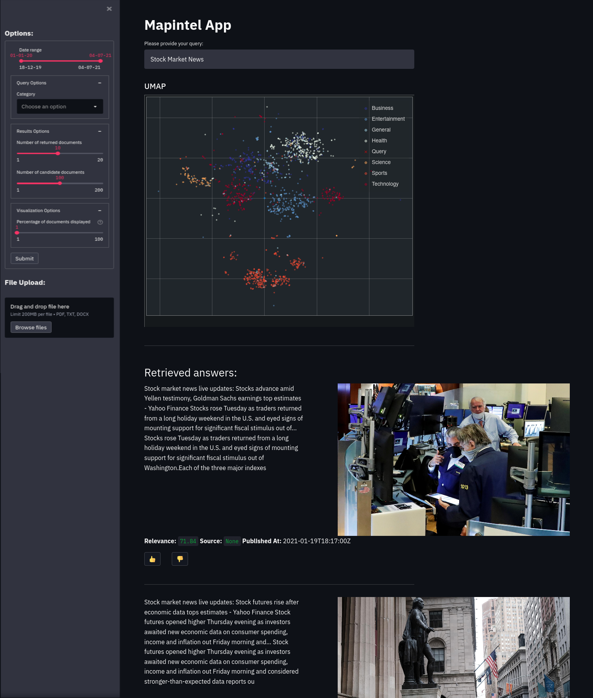

# Mapintel UI

This is a streamlit-based UI application for interactive semantic searching and exploration of a large collection of news articles.



## Usage

### Option 1: Container

Just run
```
docker-compose --profile api --profile ui up
``` 
in the root folder of the Mapintel repository. This will start three containers (Open Distro for Elasticsearch, FastAPI application, UI application).
You can find the UI application at `https://localhost:8501`

### Option 2: Local

Execute in this folder:
```
streamlit run webapp.py
```

**Requirements**: This expects a running Fast API application at `https://localhost:8000` and a running Open Distro for Elasticsearch instance at `https://localhost:9200`. Also, all python and system dependencies must be satisfied.